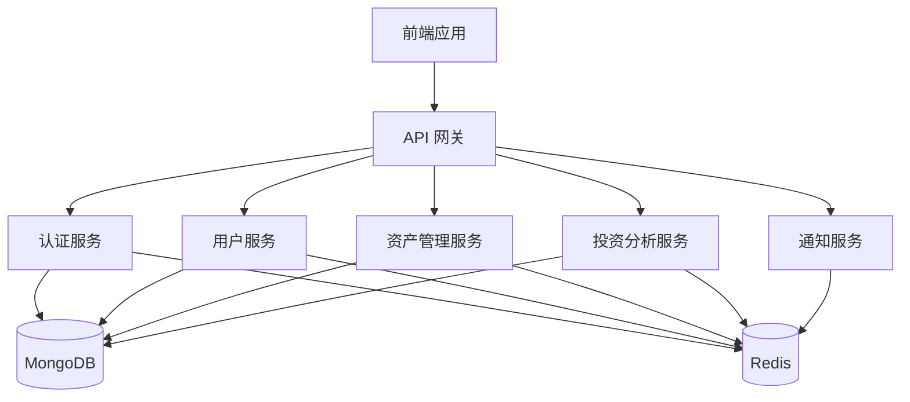
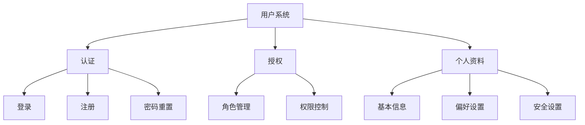
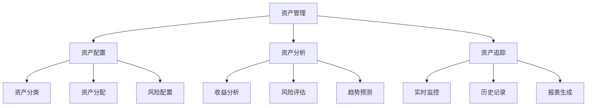
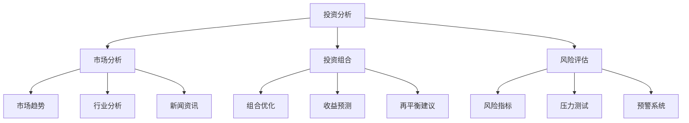
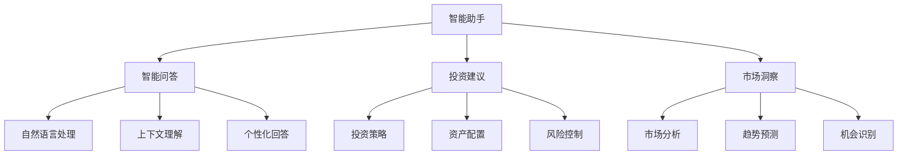
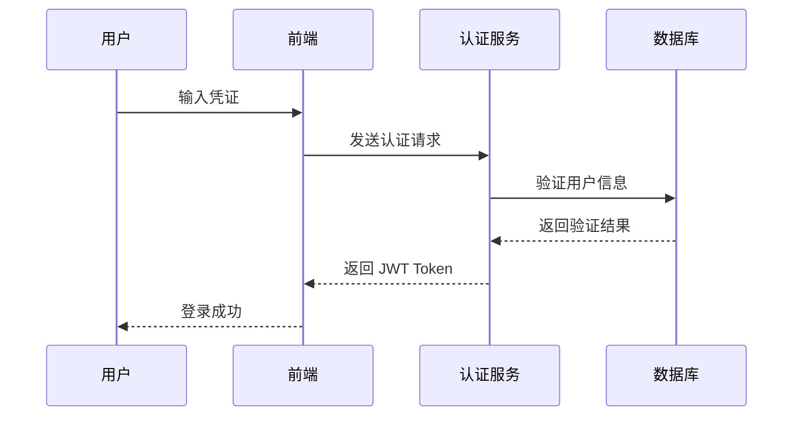
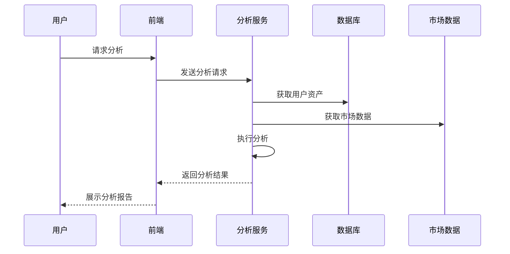
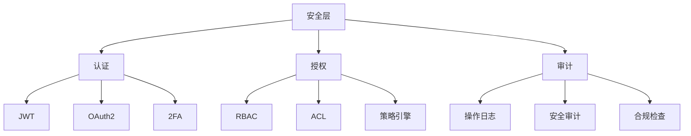
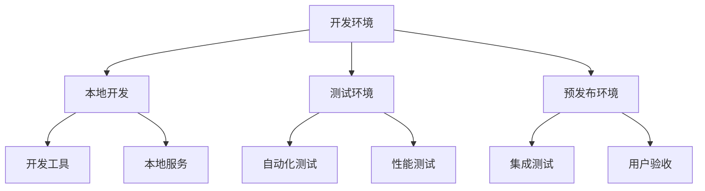
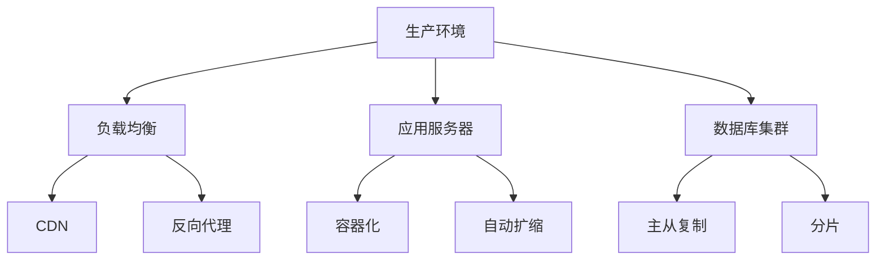

# FinCoach Plus 功能结构图

## 📊 系统架构

## 🧩 功能模块

### 1. 用户系统

### 2. 资产管理

### 3. 投资分析

### 4. 智能助手

## 🔄 数据流

### 1. 用户认证流程

### 2. 资产分析流程

## 📈 监控指标

### 1. 系统性能
- API 响应时间
- 并发用户数
- 资源使用率
- 错误率

### 2. 业务指标
- 用户活跃度
- 资产规模
- 投资回报率
- 用户满意度

### 3. 安全指标
- 认证成功率
- 异常访问次数
- 敏感操作记录
- 安全事件响应时间

## 🔐 安全架构

### 1. 认证与授权

### 2. 数据安全
- 传输加密 (TLS)
- 存储加密
- 数据脱敏
- 备份策略

## 🚀 部署架构

### 1. 开发环境

### 2. 生产环境
